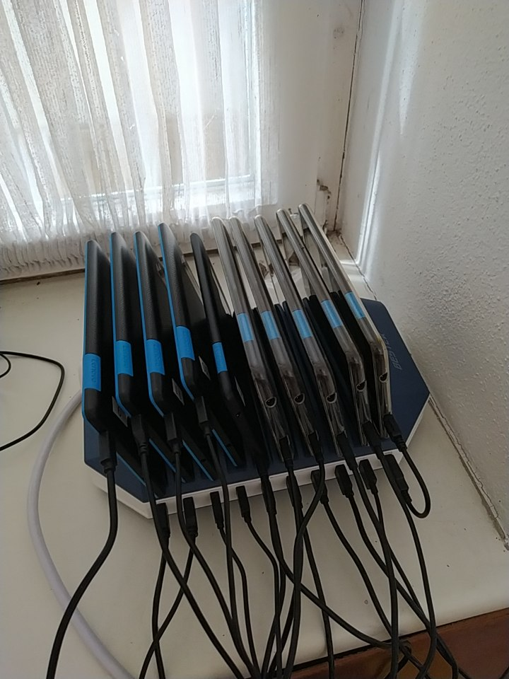

MVO
===

Dies ist das öffentliche Repository zu meiner App: **Mobiles Veranstaltungs Ordersystem** kurz MVO. 

Es ist ein überwiegend aus Consumer-Hardware bestehendes System zur Abwicklung von Bestellungen für kleine bis mittlere Heckenfeste. 

Tablets  
---- 

Als Kasse sind 90 Bestellungen pro Stunde gut möglich. Eine Bedienung schafft dauerhaft etwa 30 Bestellungen die Stunde, wenn es zusätzliche Träger gibt. In Spitzenzeiten gehen auch 40 Bestellungen die Stunde. 

Das System besteht aus:

- Server (Raspberry Pi - Python)
- Client Tabletts (Android / Kivy - Python for Android)
- WLAN-Drucker
- Epson TSE (Keine Vermietung einer Kasse ohne TSE)
- Netzwerktechnik

Ausleihbar (Kosten)
---------

Meine Preisliste sieht in der Einführungsphase folgendermaßen aus: 

| Name | Zeitraum | Preis (€) | Kommentar
| :-- | --- |  --: |  :---
| Tagespauschale | täglich | 45  | 
| Drucker  | je Wochenende | 10  | (Papier extra)
| Kassenrolle | je angefanger Rolle | 1,80 | Blue4est
| Tablet | je Tag | 5  |   Bedienung 7", Kasse 10"  
| TSE | je Wochenende | 20 | (ist bei Vermietung nicht optional, da Pflicht Vermietung einer Kasse) 
| | | alle Preise + Mehrwehrsteuer.  

Inkludiert sind: 

- Netzwerktechnik (1 Router, 1 Repeater, 1 LAN-Kabel)
- Ladestation für Tablets
- Kassenschublade
- Server 
Unterstützung bei der Erstellung der Preisliste
Einrichtung der Tablets (Preislistenauswahl + Bedienungsname)
 
Das System ist absichtlich im Inselbetrieb. Hat den Nachteil, dass es keine Fernwartungsfunktionalität gibt, aber im Funkloch funktioniert es trotzdem. 

Somit muss für digitales Zahlen auch ein anderes System beschafft werden. 

Sinnvoll kann ich es derzeit nur im Bereich südl. Breisgau Hochschwarzwald + Freiburg vermieten.

Mögliche Gesamtkosten in der Einführungsphase:
------
- Kasse mit zwei zusätzlichen Thekendruckern für ein 1. Maifest 107,20€ + 19% = 127,56 €
- Kasse, 4 Tablets für Bedienungen, 4 Thekendrucker für ein 3 tägiges Fest: 297€ + 19% = 353,43 €

Preisliste (App)
-------
Die konfiugierte Preisliste für die Kasse ist eine Kommaseparierte Liste mit 5 Spalten

| ID | Typ | Name | Preis | Parent
| -- | --- | ---- | ----  | -------
| aufsteigende Zahl | Getränk oder Trinken (Vorkonfiguration Drucker und Farbe im Menu) | Name bis 50 Zeichen  | Preis mit Komma in " | 0 oder ID eines Oberpunktes

Ein Beispiel der Preisliste ist unter [Preisliste](Preisliste_komma_vorlage_2024.csv) abgelegt. 

Kontakt
------
Kontakt über strub at gmx de oder direkt über das Repository. 
